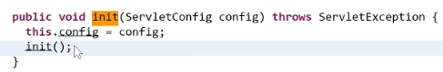
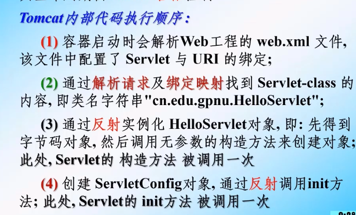
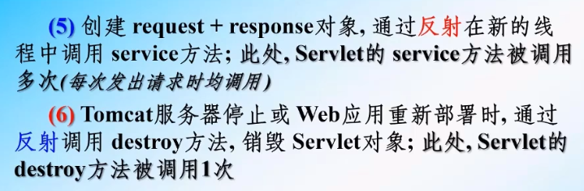
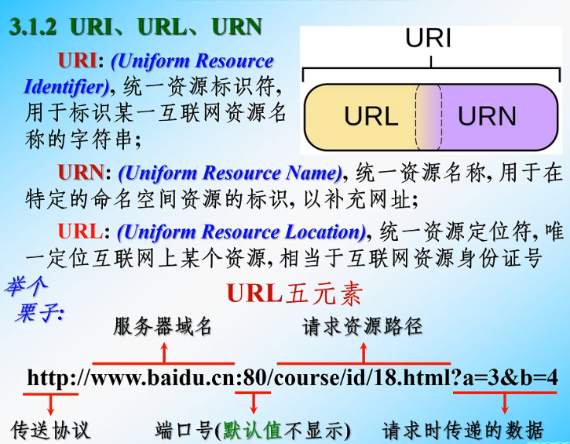
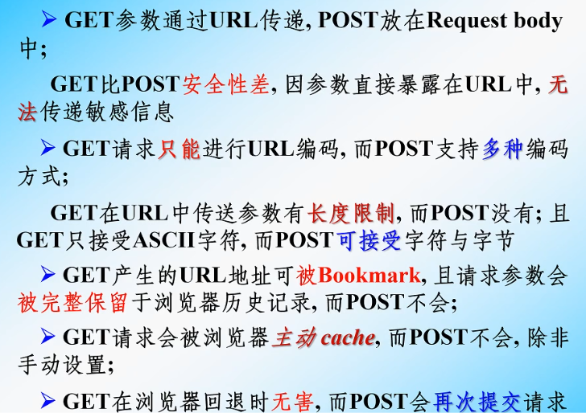
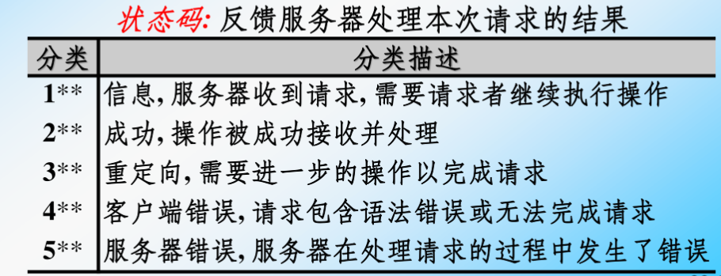
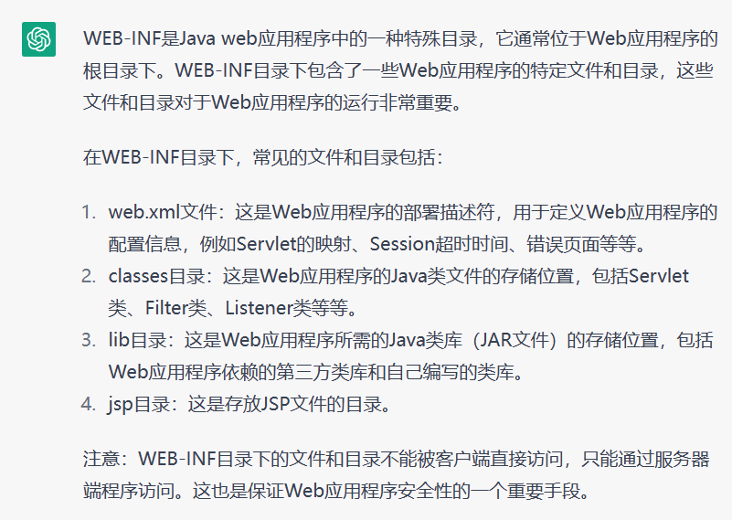

# 八、Servlet

## 001-Servlet技术

```
可以查看帮助文档
```

  


### （1）什么是Servlet？

> 1、Servlet 是 JavaEE 规范之一。规范就是**接口**
> 2、Servlet 就 JavaWeb 三大组件之一。
>
> 3、三大组件分别是：Servlet 程序、Filter 过滤器、Listener 监听器。
> 4、Servlet 是运行在服务器上的一个 java 小程序，它可以接收和响应客户端发送过来的请求，并响应数据给客户端。

### （2）手动实现 Servlet 程序

> 1、编写一个类去实现 Servlet 接口
> 2、实现 service 方法，处理请求，并响应数据
> 3、到 web.xml 中去配置 servlet 程序的访问地址
> 
> 首先要把javaweb要用到的jar包添加到该模块，上次添加的是另一个模块
> 我把name改为了lib-javaweb 这样后面新创建的模块添加这个jar包就可以了
> 
> 但是上次添加的jar包中没有servlet的jar包
> servlet的jar包在tomcat文件--->lib--->servlet-api.jar
> 点+号，把servlet-api.jar添加到lib-javaweb中


> 右击 选择add to modules 选择要加入的模块
> 然后若problems出现问题，fix点第一个就好了
> 再apply


> HelloServlet类实现Servlet接口

```java
package com.atguigu.servlet;

import jakarta.servlet.*;

import java.io.IOException;

public class HelloServlet implements Servlet {

  @Override
  public void init(ServletConfig servletConfig) throws ServletException {

  }

  @Override
  public ServletConfig getServletConfig() {
    return null;
  }

  //service方法是专门用来处理请求和响应的
  @Override
  public void service(ServletRequest servletRequest, ServletResponse servletResponse) throws ServletException, IOException {
    System.out.println("HelloServlet 被访问了");
  }

  @Override
  public String getServletInfo() {
    return null;
  }

  @Override
  public void destroy() {

  }
}
```

> web.xml 配置 servlet 程序的访问地址

```xml
<?xml version="1.0" encoding="UTF-8"?>
<web-app xmlns="http://xmlns.jcp.org/xml/ns/javaee"
         xmlns:xsi="http://www.w3.org/2001/XMLSchema-instance"
         xsi:schemaLocation="http://xmlns.jcp.org/xml/ns/javaee http://xmlns.jcp.org/xml/ns/javaee/web-app_4_0.xsd"
         version="4.0">

  <!-- servlet 标签给 Tomcat 配置 Servlet 程序 -->
  <servlet>
    <!--servlet-name 标签 Servlet 程序起一个别名（一般是类名） -->
    <servlet-name>HelloServlet</servlet-name>
    <!--servlet-class 是 Servlet 程序的全类名-->
    <servlet-class>com.atguigu.servlet.HelloServlet</servlet-class>
  </servlet>

  <!--servlet-mapping 标签给 servlet 程序配置访问地址-->
  <servlet-mapping>
    <!--servlet-name 标签的作用是告诉服务器，我当前配置的地址给哪个 Servlet 程序使用-->
    <servlet-name>HelloServlet</servlet-name>
    <!--
    url-pattern 标签配置访问地址
    / 斜杠在服务器解析的时候，表示地址为：http://ip:port/工程路径（由Tomcat的Deployment决定）
    /hello 表示地址为：http://ip:port/工程路径/hello
    -->
    <url-pattern>/hello</url-pattern>
  </servlet-mapping>

</web-app>

```

> 常见的错误 1：`url-pattern` 中配置的路径没有以斜杠打头
> 常见错误 2：`servlet-name` 配置的值不存在
> 常见错误 3：`servlet-class` 标签的全类名配置错误


### （3）url 地址怎么能访问 Servlet 程序


> 端口号唯一表示一个程序（通过端口号定位Tomcat）

### （4）Servlet 的生命周期

> Servlet从创建到销毁按顺序使用了哪些方法
>
> 1、执行 Servlet 构造器方法（构造函数）
> 2、执行 init 初始化方法（有参init是为了传递config对象，**一般重写无参`init()`方法**）
> 3、执行 service 方法
> 4、执行 destroy 销毁方法
>
> 第一、二步，是在第一次访问的时候创建 Servlet 程序会被调用
> 第三步，每次访问都会调用
> 第四步，在 web 工程停止的时候调用



```java
package com.atguigu.servlet;

import jakarta.servlet.*;

import java.io.IOException;

public class HelloServlet implements Servlet {

  public HelloServlet() {
    System.out.println("1 构造器方法");
  }

  @Override
  public void init(ServletConfig servletConfig) throws ServletException {
    System.out.println("2 init初始化方法");
  }

  @Override
  public ServletConfig getServletConfig() {
    return null;
  }

  //service方法是专门用来处理请求和响应的
  @Override
  public void service(ServletRequest servletRequest, ServletResponse servletResponse) throws ServletException, IOException {
    System.out.println("3 service == HelloService 被访问了");
  }

  @Override
  public String getServletInfo() {
    return null;
  }

  @Override
  public void destroy() {
    System.out.println("4 destroy销毁方法");
  }
}
```


### （5）GET 和 POST 请求的分开处理

> 用户访问服务器时，提交数据的请求方式：`get`和`post`
> 服务器要对这两种请求方式分开处理

```java
public class HelloServlet implements Servlet {
	//...
	
	//service 方法是专门用来处理请求和响应的
	@Override
	public void service(ServletRequest servletRequest, ServletResponse servletResponse) throws ServletException, IOException {
		//要获得请求的方式，使用ServletRequest接口的子接口HttpServletRequest
		//因为HttpServletRequest有获得请求方式的方法 getMethod()
		//所以要进行强制转换
		HttpServletRequest httpServletRequest = (HttpServletRequest) servletRequest;
		// 获取请求的方式
		String method = httpServletRequest.getMethod();
		
		if ("GET".equals(method)) {
			doGet();
		} else if ("POST".equals(method)) {
			doPost();
		}
	}
	
	/**
	* 做 get 请求的操作
	*/
	public void doGet(){
		System.out.println("get 请求");
		System.out.println("get 请求");
	}
	/**
	* 做 post 请求的操作
	*/
	public void doPost(){
		System.out.println("post 请求");
		System.out.println("post 请求");
	}
}
```

> ctrl+h 可以查看该类/接口有多少子类/子接口

### （6）通过继承 HttpServlet 实现 Servlet 程序

> 一般在实际项目开发中，都是使用继承 HttpServlet 类的方式去实现 Servlet 程序。
>
> 1、编写一个类去继承 HttpServlet 类
> 2、根据业务需要重写 doGet 或 doPost 方法
> 3、到 web.xml 中的配置 Servlet 程序的访问地址

Servlet 类的代码：

```java
package com.atguigu.servlet;

import jakarta.servlet.ServletException;
import jakarta.servlet.http.HttpServlet;
import jakarta.servlet.http.HttpServletRequest;
import jakarta.servlet.http.HttpServletResponse;

import java.io.IOException;

public class HelloServlet2 extends HttpServlet {
  //get请求时调用
  @Override
  protected void doGet(HttpServletRequest req, HttpServletResponse resp) throws ServletException, IOException {
    System.out.println("HelloServlet2 的doGet()方法");
  }

  //post请求时调用
  @Override
  protected void doPost(HttpServletRequest req, HttpServletResponse resp) throws ServletException, IOException {
    System.out.println("HelloServlet2 的doPost()方法");
  }
}

```

> web.xml 中的配置：

```xml
  <servlet>
    <servlet-name>HelloServlet2</servlet-name>
    <servlet-class>com.atguigu.servlet.HelloServlet2</servlet-class>
  </servlet>
  <servlet-mapping>
    <servlet-name>HelloServlet2</servlet-name>
    <url-pattern>/hello2</url-pattern>
  </servlet-mapping>
```

### （7）使用 IDEA 创建 Servlet 程序

> 确实是通过继承 HttpServlet 实现 Servlet 程序
> 但是还有更方便的方法直接生成实现类和配置文件
> 直接new ---> Servlet
> 
> 如果new 没有Servlet
> 按以下方法：
> 


> 最下面的Source Roots打勾✔就好了

  


  


> 不选`annotated class`注解，然后点OK
> 然后会自动跳转到`web.xml`，再添加一下`<servlet-mapping>`就好了
> 
> 如果选了`annotated class`注解，会直接在实现类`HelloServlet3`中配置 要在`web.xml`中要配置的东西
> 

### （8）Servlet [类的继承](https://so.csdn.net/so/search?q=%E7%B1%BB%E7%9A%84%E7%BB%A7%E6%89%BF&spm=1001.2101.3001.7020)体系


### (9)	Tomcat内部代码执行顺序





## 002-[ServletConfig](https://so.csdn.net/so/search?q=ServletConfig&spm=1001.2101.3001.7020) 类

> 
> ServletConfig 类从类名上来看，就知道是 **Servlet 程序的配置信息类** 
> 
> ServletConfig 类的三大作用
> 		1、可以获取 Servlet 程序的别名 `servlet-name `的值
> 		2、获取初始化参数 `init-param`（只能是`ServletConfig`获取的，而不是 `ServletContext  `）
> 		3、获取 `ServletContext  `对象

```java
package com.atguigu.servlet;

import jakarta.servlet.*;

import java.io.IOException;

public class HelloServlet implements Servlet {

  public HelloServlet() {
    System.out.println("1 构造器方法");
  }

  @Override
  public void init(ServletConfig servletConfig) throws ServletException {
    System.out.println("2 init初始化方法");

    //ServletConfig 类的三大作用
    //1、可以获取 Servlet 程序的别名 servlet-name 的值
    System.out.println("HelloServlet程序的别名是："+servletConfig.getServletName());

    //2、获取初始化参数 init-param
    //首先要在web.xml中对应的<servlet></servlet>中配置<init-param></init-param>
    //获取初始化参数的值
    System.out.println("初始化参数username的值是："+servletConfig.getInitParameter("username"));

    //3、获取 ServletContext 对象
    System.out.println(servletConfig.getServletContext());
  }

  @Override
  public ServletConfig getServletConfig() {
    return null;
  }

  //service方法是专门用来处理请求和响应的
  @Override
  public void service(ServletRequest servletRequest, ServletResponse servletResponse) throws ServletException, IOException {
    System.out.println("3 service == HelloService 被访问了");
  }

  @Override
  public String getServletInfo() {
    return null;
  }

  @Override
  public void destroy() {
    System.out.println("4 destroy销毁方法");
  }
}


```

> 
> web.xml的代码：
>

```xml
  <!-- servlet 标签给 Tomcat 配置 Servlet 程序 -->
  <servlet>
    <!--servlet-name 标签 Servlet 程序起一个别名（一般是类名） -->
    <servlet-name>HelloServlet</servlet-name>
    <!--servlet-class 是 Servlet 程序的全类名-->
    <servlet-class>com.atguigu.servlet.HelloServlet</servlet-class>

    <!--配置init-param初始化参数(是键值对)，可以配置多个-->
    <init-param>
      <!--参数名-->
      <param-name>username</param-name>
      <!--参数值-->
      <param-value>root</param-value>
    </init-param>

  </servlet>
```

> `Servlet` 程序和 `ServletConfig `对象都是由` Tomcat `负责创建，我们负责使用。
> `Servlet` 程序默认是第一次访问的时候创建，`ServletConfig `是每个 `Servlet `程序创建时，就创建一个对应的 `ServletConfig` 对象
>
> 每个`Servlet`程序都会有一个`ServletConfig`对象
> 不同的`Servlet`程序的`ServletConfig`对象不同
> 程序A不能调用程序B的`ServletConfig`对象e

```java
注意：如果重写了init方法，要在该方法内加上super.init(config);
原因：
	GenericServlet类是HttpServlet类的父类
	
	GenericServlet类中有ServletConfig对象的引用
	
	getServletConfig();方法是GenericServlet类中的方法
	该方法会返回一个ServletConfig对象
	
	GenericServlet类中也有init方法
	该方法中保存了GenericServlet类中的ServletConfig对象

	如果重写了init方法，代表GenericServlet类中的init方法没了，
	代表GenericServlet类中的ServletConfig对象也没了，
	所以getServletConfig()方法就得不到ServletConfig对象了

	而写了super.init(config); 调用了父类的init方法，代表父类的init方法还在
	代表GenericServlet类中的ServletConfig对象还在
	getServletConfig()方法可以得到ServletConfig对象
	

public class HelloServlet2 extends HttpServlet {

  //get请求时调用
  @Override
  protected void doGet(HttpServletRequest req, HttpServletResponse resp) throws ServletException, IOException {

  }


  //重写init方法
  @Override
  public void init(ServletConfig config) throws ServletException {
    //如果不加这句话，doPost中的ServletConfig对象会失效
    super.init(config);
  }


  //post请求时调用
  @Override
  protected void doPost(HttpServletRequest req, HttpServletResponse resp) throws ServletException, IOException {
  	//可以通过getServletConfig()方法获得ServletConfig对象
    ServletConfig servletConfig = getServletConfig();
  }
}
```


> 或者是用无参的`init()`方法

## 003-[ServletContext](https://so.csdn.net/so/search?q=ServletContext&spm=1001.2101.3001.7020) 类

### （1）什么是 ServletContext?

> 1、`ServletContext` 是一个接口，它表示 `Servlet` 上下文对象
> 2、一个 web 工程，只有一个 `ServletContext` 对象实例。
> 3、`ServletContext` 对象是一个域对象。
>
> 什么是域对象?
> 域对象，是可以像 Map 一样存取数据的对象，叫域对象。
> 这里的域指的是存取数据的操作范围，整个 web 工程。
>
> ​		    			存数据 					取数据 						删除数据
> **Map** 	 			put() 			    		get() 			  			remove()
> **域对象** 	setAttribute() 		getAttribute() 		removeAttribute()
>
> 4、`ServletContext `是在 web 工程部署启动的时候创建。在 web 工程停止的时候销毁。

### （2）ServletContext类的四个作用

> 1、获取 `web.xml` 中配置的上下文参数 `context-param`（只能是`ServletContext` 获取，`ServletConfig`不行）
> 2、获取当前的工程路径，格式："  /工程路径  "
> 3、获取工程部署后在服务器硬盘上的绝对路径
>
> 4、像 Map 一样存取数据
> 整个web工程只有一个`ServletContext` 对象
> 无论在这个工程下写了几个类，创建了几个`ServletContext` 对象，都是同一个`ServletContext` 对象
> 在工程停止之前，存数据，不同类中的`ServletContext `对象 都能访问到数据（同一个数据）
> 工程停止之后，数据就没了

```java
package com.atguigu.servlet;

import jakarta.servlet.*;
import jakarta.servlet.http.*;

import java.io.IOException;

public class ServletContext1 extends HttpServlet {
  @Override
  protected void doGet(HttpServletRequest request, HttpServletResponse response) throws ServletException, IOException {
    //ServletContext类的四个作用
    //1、获取 web.xml 中配置的上下文参数 context-param
    //首先在web.xml中配置上下文参数context-param
    //获取ServletContext对象，getServletContext()能直接用是因为这是父类的方法，继承父类，子类能直接用
    ServletContext context = getServletContext();

    String username = context.getInitParameter("username");
    System.out.println("context-param参数username的值是："+username);

    //2、获取当前的工程路径，格式: /工程路径（/06_Servlet）
    System.out.println("当前工程路径是："+context.getContextPath());

    //3、获取工程部署后在服务器硬盘上的绝对路径
    //  / 斜杠被服务器解析地址为:http://ip:port/工程名/  映射(等于)到 IDEA 中该工程的 web 目录

    System.out.println("工程部署后在硬盘上的绝对路径是(文件真实路径)："+context.getRealPath("/"));


  }

  @Override
  protected void doPost(HttpServletRequest request, HttpServletResponse response) throws ServletException, IOException {

  }
}

```

```java
package com.atguigu.servlet;

import jakarta.servlet.*;
import jakarta.servlet.http.*;

import java.io.IOException;

public class ServletContext2 extends HttpServlet {
  @Override
  protected void doGet(HttpServletRequest request, HttpServletResponse response) throws ServletException, IOException {
    //ServletContext类的四个作用
    //4、像 Map 一样存取数据
    //获得ServletContext对象
    ServletContext servletContext = getServletContext();

    //存数据
    servletContext.setAttribute("key1","value1");
    //取数据
    System.out.println("获取域数据key1的值是："+servletContext.getAttribute("key1"));
  }
}

```

```xml
<servlet>
    <servlet-name>ServletContext1</servlet-name>
    <servlet-class>com.atguigu.servlet.ServletContext1</servlet-class>
  </servlet>
  <servlet-mapping>
    <servlet-name>ServletContext1</servlet-name>
    <!-- "/" 不能少 -->
    <url-pattern>/servletContext1</url-pattern>
  </servlet-mapping>


  <servlet>
    <servlet-name>ServletContext2</servlet-name>
    <servlet-class>com.atguigu.servlet.ServletContext2</servlet-class>
  </servlet>
  <servlet-mapping>
    <servlet-name>ServletContext2</servlet-name>
    <url-pattern>/servletContext2</url-pattern>
  </servlet-mapping>
```

## 004-HTTP 协议

### （1）什么是 HTTP 协议

> 什么是协议?
> 协议是指双方，或多方，相互约定好，大家都需要遵守的规则，叫协议。
>
> 所谓 HTTP 协议，就是指，客户端和服务器之间通信时，发送的数据，需要遵守的规则，叫 HTTP 协议。
>
> HTTP 协议中的数据又叫报文

####  1）URI、URL、URN



### （2）请求的 HTTP 协议格式

> 客户端给服务器发送数据叫请求。
> 服务器给客户端回传数据叫响应。

> 注：请求的`html`文件中，只有产生（引入）外部资源才会再次发生请求。
>
> Q：一个`html`页面中有三张不同的图片，问请求了几次？
>
> A：四次，一次请求`html`代码，三次请求图片。
>
> Q：如果是同一张呢？
>
> A：四次。（同样会发起请求，但是浏览器会发现数据相同，缓冲会解决，于是请求就没有往服务器上发送，所以看起来好像只请求了两次）

> 请求又分为 GET 请求，和 POST 请求两种
> 
>i. GET 请求格式
> 	1、请求行
>			(1) 请求的方式 GET
> 			(2) 请求的资源路径[+?+请求参数]   []中的可有可不有
> 			(3) 请求的协议的版本号 HTTP/1.1
> 	2、请求头
> 			key : value 组成 不同的键值对，表示不同的含义。


> ii. POST 请求格式
> 	1、请求行
> 			(1) 请求的方式 POST
> 			(2) 请求的资源路径[+?+请求参数]
> 			(3) 请求的协议的版本号 HTTP/1.1
>
> ​	2、请求头
> ​			key : value 不同的请求头，有不同的含义
>
> ​	3、请求体 => 就是发送给服务器的数据


> iii. 常用请求头的说明
> 	`Accept`：表示客户端可以接收的数据类型 
> 	`Accpet-Languege`：表示客户端可以接收的语言类型
> 	`User-Agent`：表示客户端浏览器的信息
> 	`Host`： 表示请求时的服务器 ip 和端口
> 
>iv. 哪些是 GET 请求，哪些是 POST 请求
> 	GET 请求有哪些：
> 			1、form 标签 method=get
> 			2、a 标签
> 			3、link 标签引入 css
> 			4、Script 标签引入 js 文件
> 			5、img 标签引入图片
> 			6、iframe 引入 html 页面
> 			7、在浏览器地址栏中输入地址后敲回车   
> 				---->怪不得！上面ServletContext的四个作用把代码写在了doGet()方法里，而不写在doPost()方法里，
> 			因为在地址栏输入访问地址之后回车，回车是get请求，如果写在doPost()方法里，回车之后控制台不输出信息(如System.out.println();)
> 
>​	POST 请求有哪些：
> ​			8、form 标签 method=post

### （3）GET 和 POST 的区别



> 解释最后一点：当提交表单后点击回退，`GET`方式不会再次提交请求，而`POST`会

### （4）响应的 HTTP 协议格式

> 1、响应行
> 		(1) 响应的协议和版本号
> 		(2) 响应状态码
> 		(3) 响应状态描述符（对状态码的描述）



> 2、响应头
> 		(1) key : value 不同的响应头，有其不同含义
> 
> 空行隔开
>
> 3、响应体 => 就是回传给客户端的数据


> 常用的响应码说明：
> 		200 表示请求成功
> 		302 表示请求重定向（明天讲）
> 		404 表示请求服务器已经收到了，但是你要的数据不存在（请求地址错误）
> 		500 表示服务器已经收到请求，但是服务器内部错误（代码错误）

### （5）MIME 类型说明

> `MIME` 是 HTTP 协议中数据类型。
>
> `MIME` 的英文全称是"Multipurpose Internet Mail Extensions" 多功能 Internet 邮件扩充服务。
> `MIME` 类型的格式是“大类型/小类型”，并与某一种文件的扩展名相对应。
>
> 常见的 `MIME` 类型：


> `rtf`文件是二进制格式
>
> `.gz`和`.tar`是`Linux`常用的压缩格式

### （6）谷歌和火狐浏览器如何查看http协议(请求与响应)

> 上述是使用IE浏览器查看，需下载Httpwatch
> 好像现在IE浏览器不用使用Httpwatch，查看方法跟下面谷歌火狐一样 （F12 网络）
>
> 谷歌浏览器如何查看 HTTP 协议：


> 火狐浏览器如何查看 HTTP 协议：


## 005-HttpServletRequest 类

### （1）HttpServletRequest 类有什么作用

> 每次只要有请求进入 `Tomcat `服务器，`Tomcat `服务器就会把请求过来的 `HTTP `协议信息解析好封装到 `Request` 对象中。
>
> 然后传递到 `service` 方法（`doGet` 和 `doPost`）中给我们使用。
>
> 我们可以通过 `HttpServletRequest` 对象，获取到所有请求的信息。

### （2）HttpServletRequest 类的常用方法

> ```
> getRequestURI() 			获取请求的资源路径(统一资源标识符)
> getRequestURL() 			获取请求的统一资源定位符（绝对路径）
> getRemoteHost() 			获取客户端的 ip 地址
> getHeader() 				获取请求头
> getParameter() 				获取请求的参数
> getParameterValues() 		获取请求的参数（多个值的时候使用）
> getMethod() 				获取请求的方式 GET 或 POST
> setAttribute(key, value)	设置域数据
> getAttribute(key)			获取域数据
> getRequestDispatcher() 		获取请求转发对象
> ```
>

```java
package com.atguigu.HttpServletRequestClass;

import jakarta.servlet.*;
import jakarta.servlet.http.*;

import java.io.IOException;

public class RequestAPIServlet extends HttpServlet {
  @Override
  protected void doGet(HttpServletRequest request, HttpServletResponse response) throws ServletException, IOException {
    //HttpServletRequest 类的常用方法
    //getRequestURI() 			获取请求的资源路径
    System.out.println("URI => " + request.getRequestURI());//URI => /08-servlet/requestAPIServlet

    //getRequestURL() 			获取请求的统一资源定位符（绝对路径）
    System.out.println("URL => " + request.getRequestURL());//URL => http://localhost:8080/08-servlet/requestAPIServlet

    //getRemoteHost() 			获取客户端的 ip 地址
    /*
    在IDEA中，用localhost访问，得到的客户端ip地址是：127.0.0.1
    在IDEA中，用127.0.0.1访问，得到的客户端ip地址是：127.0.0.1
    在IDEA中，用 真实ip 访问，得到的客户端ip地址是：真实的ip地址
     */
    System.out.println("客户端ip地址 =>" + request.getRemoteHost());

    //getHeader()           获取请求头
    System.out.println("请求头中的User-Agent =>" + request.getHeader("User-Agent"));

    //getMethod() 				  获取请求的方式 GET 或 POST
    System.out.println("请求的方式 =>" + request.getMethod());//在地址栏敲回车是get请求
  }
}

```

```xml
<servlet>
    <servlet-name>RequestAPIServlet</servlet-name>
    <servlet-class>com.atguigu.HttpServletRequestClass.RequestAPIServlet</servlet-class>
  </servlet>
  <servlet-mapping>
    <servlet-name>RequestAPIServlet</servlet-name>
    <url-pattern>/requestAPIServlet</url-pattern>
  </servlet-mapping>
```

### （3）如何获取客户端发送来的请求参数

> ```
> getParameter()
> getParameterValues()
> ```
> 填写表单提交给服务器
>

```java
package com.atguigu.HttpServletRequestClass;

import jakarta.servlet.*;
import jakarta.servlet.http.*;

import java.io.IOException;
import java.util.Arrays;

public class ParameterServlet extends HttpServlet {
  @Override
  protected void doGet(HttpServletRequest request, HttpServletResponse response) throws ServletException, IOException {
    //如何获取客户端发送来的请求参数

    String username = request.getParameter("username");
    String password = request.getParameter("password");

    //getParameter只能接收一个参数，要接收多个参数要使用getParameterValues
    //String hobby = request.getParameter("hobby");
    String[] hobby = request.getParameterValues("hobby");

    System.out.println("用户名："+username);
    System.out.println("密码："+password);
    System.out.println("兴趣爱好："+ Arrays.asList(hobby));
  }
}

```

```html
<!DOCTYPE html>
<html lang="en">
<head>
  <meta charset="UTF-8">
  <title>Title</title>
</head>
<body>

<form action="http://localhost:8080/08-servlet/parameterServlet" method="get">
  用户名：<input type="text" name="username" />
  <br>
  密码：<input type="password" name="password" />
  <br>
  兴趣爱好：<input type="checkbox" name="hobby" value="cpp" />C++
  <input type="checkbox" name="hobby" value="java" />Java
  <input type="checkbox" name="hobby" value="js" />JavaScript
  <br>
  <input type="submit" />
</form>

</body>
</html>

```

```xml
  <servlet>
    <servlet-name>ParameterServlet</servlet-name>
    <servlet-class>com.atguigu.HttpServletRequestClass.ParameterServlet</servlet-class>
  </servlet>
  <servlet-mapping>
    <servlet-name>ParameterServlet</servlet-name>
    <url-pattern>/parameterServlet</url-pattern>
  </servlet-mapping>
```

### （4）doPOST 请求的中文乱码解决

> ```java
> req.setCharacterEncoding("UTF-8"); 		这行代码要写在获取参数之前才有用
> ```
>


### （5）请求的转发

> **请求转发**：服务器收到请求后，从一个资源跳转到另一个资源的操作叫请求转发。
>
> 利用域数据（可以多个Servlet程序共享）传递数据


> 从浏览器访问`Servlet1`程序
>
> 请求转发特点：
> 		1、浏览器的地址栏没有变化
> 		2、虽然访问了两个程序，但是是一次请求
> 		3、它们共享`Request`域中的数据
> 		4、可以转发到`WEB-INF`目录下
>
> ​	一般浏览器无法访问`WEB-INF`目录下的文件
> ​	但是可以通过请求转发访问`WEB-INF`目录下的文件
> ​	`/servlet1 --> /WEB-INF/`文件名


> 5、不可以访问当前工程以外的资源

> - WEB-INF目录：



```java
package com.atguigu.HttpServletRequestClass;

import jakarta.servlet.*;
import jakarta.servlet.http.*;

import java.io.IOException;

public class Servlet1 extends HttpServlet {
  //请求转发1
  @Override
  protected void doGet(HttpServletRequest request, HttpServletResponse response) throws ServletException, IOException {
    //获取请求的参数(办事的材料)查看
    String username = request.getParameter("username");
    System.out.println("在Servlet1(柜台1)中查看参数(材料)" + username);

    //给材料盖一个章
    request.setAttribute("key","柜台1的章");
    
    //并传递到Servlet2(柜台2)去查看
    //问路：Servlet2(柜台2)怎么走
    
    //获取请求转发对象，要转发给谁
    // “/” 请求转发必须以斜杠打头，斜杠表示地址为：http://ip:port/工程名/，映射到IDEA的web目录
    RequestDispatcher requestDispatcher = request.getRequestDispatcher("/servlet2");
    
    //走向Servlet2(柜台2)
    requestDispatcher.forward(request,response);
    
  }
}

```

```xml
  <servlet>
    <servlet-name>Servlet1</servlet-name>
    <servlet-class>com.atguigu.HttpServletRequestClass.Servlet1</servlet-class>
  </servlet>
  <servlet-mapping>
    <servlet-name>Servlet1</servlet-name>
    <url-pattern>/servlet1</url-pattern>
  </servlet-mapping>
```

```java
package com.atguigu.HttpServletRequestClass;

import jakarta.servlet.*;
import jakarta.servlet.http.*;

import java.io.IOException;

public class Servlet2 extends HttpServlet {
  //请求转发2
  @Override
  protected void doGet(HttpServletRequest request, HttpServletResponse response) throws ServletException, IOException {
    //获取请求的参数(办事的材料)查看
    String username = request.getParameter("username");
    System.out.println("在Servlet1(柜台1)中查看参数(材料)" + username);

    //查看柜台1是否有盖章
    Object key = request.getAttribute("key");
    System.out.println("柜台1是否有盖章：" + key);

    //处理自己的业务
    System.out.println("Servlet2 处理自己的业务");
  }
}

```

```xml
  <servlet>
    <servlet-name>Servlet2</servlet-name>
    <servlet-class>com.atguigu.HttpServletRequestClass.Servlet1</servlet-class>
  </servlet>
  <servlet-mapping>
    <servlet-name>Servlet2</servlet-name>
    <url-pattern>/servlet2</url-pattern>
  </servlet-mapping>
```


### （6）base 标签的作用


```html
<!DOCTYPE html>
<html lang="zh_CN">
<head>
<meta charset="UTF-8">
<title>Title</title>
<!--base 标签设置页面相对路径工作时参照的地址
href 属性就是参数的地址值
-->
<base href="http://localhost:8080/07_servlet/a/b/">
</head>
<body>
这是 a 下的 b 下的 c.html 页面<br/>
<a href="../../index.html">跳回首页</a><br/>
</body>
</html>
```

### （7）Web 中的相对路径和绝对路径


### （8）web 中 / 斜杠的不同意义

  


## 006-HttpServletResponse 类

### （1）HttpServletResponse 类的作用

> `HttpServletResponse` 类和 `HttpServletRequest` 类一样。
> 每次请求进来，Tomcat 服务器都会创建一个 `Response` 对象传递给 `Servlet` 程序去使用。
> `HttpServletRequest` 表示请求过来的信息，`HttpServletResponse` 表示所有响应的信息
> 我们如果需要设置返回给客户端的信息，都可以通过 `HttpServletResponse`

### （2）两个输出流的说明

> 如何给客户端返回信息？	通过响应流（输出流）
> 	
> 字节流 `getOutputStream();` 	常用于下载（传递二进制数据）
> 字符流 `getWriter();` 					常用于回传字符串（常用）
>
> 两个流同时只能使用一个。
> 使用了字节流，就不能再使用字符流，反之亦然，否则就会报错。

### （3）如何往客户端回传数据

```
要求 ： 往客户端回传 字符串 数据
```


### （4）往客户端传中文信息会出现乱码的解决

```java
package com.atguigu.HttpServletRequestClass;

import jakarta.servlet.*;
import jakarta.servlet.http.*;

import java.io.IOException;
import java.io.PrintWriter;
import java.io.Writer;

public class ResponseIOServlet extends HttpServlet {
  @Override
  protected void doGet(HttpServletRequest request, HttpServletResponse response) throws ServletException, IOException {
    //要求 ： 往客户端回传 字符串 数据
    PrintWriter writer = response.getWriter();
    //writer.write("response's content!!!");

    //writer.write("哈哈哈哈");//鍝堝搱鍝堝搱


    //服务器的字符集：UTF-8
    System.out.println(response.getCharacterEncoding());

    //如果服务器的字符集不是UTF-8
    //设置服务器的字符集是UTF-8
    //response.setCharacterEncoding("UTF-8");

    //但是浏览器和服务器的字符集不同还是会出现问题
    //通过响应头设置浏览器的字符集也是UTF-8
    response.setHeader("Content-Type","text/html; charset=UTF-8");

    writer.write("哈哈哈哈");


    //还有一个更简单的方法
    //同时设置了服务器和客户端浏览器的字符集，还设置了响应头
    //注意：此方法必须要在获取流对象之前使用才有效（获取流指的是PrintWriter writer = response.getWriter();）
    response.setContentType("text/html; charset=UTF-8");
  }
}

```

### （5）请求重定向

> 请求重定向，是指客户端给服务器发请求，然后服务器告诉客户端说。
> 我给你一个新地址。你去新地址访问。
> 叫请求重定向（因为之前的地址可能已经被废弃）


```java
package com.atguigu.HttpServletRequestClass;

import jakarta.servlet.*;
import jakarta.servlet.http.*;

import java.io.IOException;

public class Response1 extends HttpServlet {
  @Override
  protected void doGet(HttpServletRequest request, HttpServletResponse response) throws ServletException, IOException {
    System.out.println("曾到此一游 Response1");

    //设置响应状态码302，表示重定向（已搬迁）
    response.setStatus(302);

    //设置响应头，说明新的地址在哪里
    response.setHeader("Location","http://localhost:8080/08-servlet/response2");
  }
}

```

```xml
  <servlet>
    <servlet-name>Response1</servlet-name>
    <servlet-class>com.atguigu.HttpServletRequestClass.Response1</servlet-class>
  </servlet>
  <servlet-mapping>
    <servlet-name>Response1</servlet-name>
    <url-pattern>/response1</url-pattern>
  </servlet-mapping>
```

```java
package com.atguigu.HttpServletRequestClass;

import jakarta.servlet.*;
import jakarta.servlet.http.*;

import java.io.IOException;

public class Response2 extends HttpServlet {
  @Override
  protected void doGet(HttpServletRequest request, HttpServletResponse response) throws ServletException, IOException {
    response.getWriter().write("response2's result");
  }
}

```

```xml
  <servlet>
    <servlet-name>Response2</servlet-name>
    <servlet-class>com.atguigu.HttpServletRequestClass.Response2</servlet-class>
  </servlet>
  <servlet-mapping>
    <servlet-name>Response2</servlet-name>
    <url-pattern>/response2</url-pattern>
  </servlet-mapping>
```

 

> `Tomcat`每次发起请求都会重新产生一个`Request`对象

