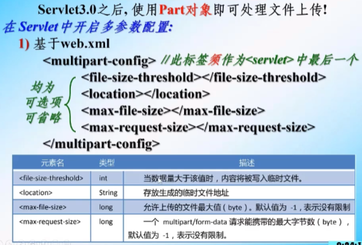
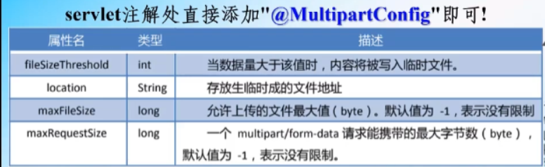
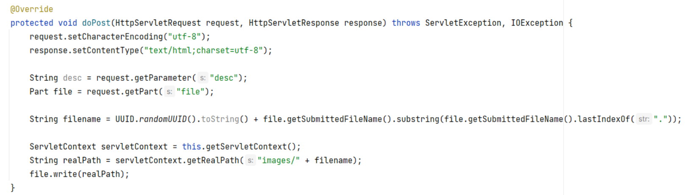

## Part

### （1）文件的上传

- 基于web.xml



- 基于“注解”

  

  > 如果不对上传的文件大小加以限制，只需要添加`@MultipartConfig`即可
  >
  > 其目的就是为了区分获取表单信息时存在子节和字符的情况

### （2）Part对象中常用的方法


> 注意：在form表单中要添加属性enctype
>
> ```
> <form action="Test" method="post" enctype="multipart/form-data">
> </form>
> ```



> 如果用来存储的文件夹目前是空的，那么idea在创建project时是不会创建该文件夹的，此时如果使用write方法书写，就会出现路径错误。
>
> 所以一定要往该文件夹内放某个东西，idea在加载该项目时，就会在out文件夹中创建该文件夹，以及相应的资源，此时不会出现路径错误。
