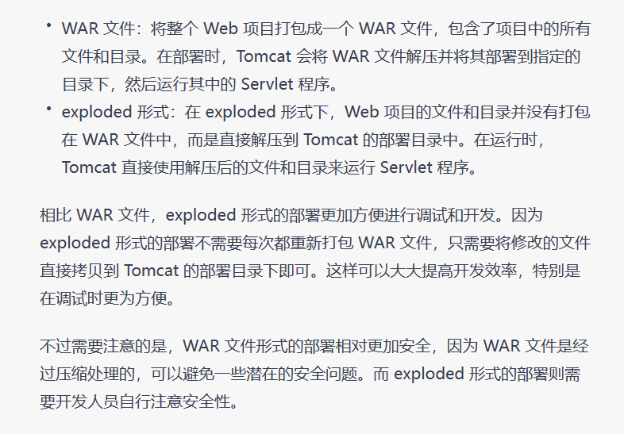

# 七、Tomcat

> 中文乱码加	`-Dfile.encoding=UTF-8`

## 001-JavaWeb 的概念

> - 什么是 JavaWeb
	JavaWeb 是指，所有通过 Java 语言编写可以通过浏览器访问的程序的总称，叫 JavaWeb。
	JavaWeb 是基于请求和响应来开发的。
  - 什么是请求
	请求是指客户端给服务器发送数据，叫请求 Request。 
  - 什么是响应
	响应是指服务器给客户端回传数据，叫响应 Response。 
  - 请求和响应的关系
	请求和响应是成对出现的，有请求就有响应。


## 002-Web 资源的分类

```
web 资源按实现的技术和呈现的效果的不同，又分为静态资源和动态资源两种。

静态资源： html、css、js、txt、mp4 视频 , jpg 图片
动态资源： jsp 页面、Servlet 程序
```

## 003-常用的 Web 服务器

```
Tomcat：由 Apache 组织提供的一种 Web 服务器，提供对 jsp 和 Servlet 的支持。
它是一种轻量级的 javaWeb 容器（服务器），也是当前应用最广的 JavaWeb 服务器（免费）。

Jboss：是一个遵从 JavaEE 规范的、开放源代码的、纯 Java 的 EJB 服务器，它支持所有的 JavaEE 规范（免费）。

GlassFish： 由 Oracle 公司开发的一款 JavaWeb 服务器，是一款强健的商业服务器，达到产品级质量（应用很少）。

Resin：是 CAUCHO 公司的产品，是一个非常流行的服务器，对 servlet 和 JSP 提供了良好的支持，
性能也比较优良，resin 自身采用 JAVA 语言开发（收费，应用比较多）。

WebLogic：是 Oracle 公司的产品，是目前应用最广泛的 Web 服务器，支持 JavaEE 规范，
而且不断的完善以适应新的开发要求，适合大型项目（收费，用的不多，适合大公司）。
```

## 004-Tomcat 服务器和 Servlet 版本的对应关系


>Servlet 程序从 2.5 版本是现在世面使用最多的版本（xml 配置）
到了 Servlet3.0 之后。就是注解版本的 Servlet 使用。
以 2.5 版本为主线讲解 Servlet 程序。

## 005-Tomcat的使用

### （1）安装

>安装版本Tomcat8
找到你需要用的 Tomcat 版本对应的zip压缩包，解压到需要安装的目录即可。

### （2）目录介绍

>bin		   		专门用来存放 Tomcat 服务器的可执行程序
conf 				专门用来存放 Tocmat 服务器的配置文件
lib		    		专门用来存放 Tomcat 服务器的 jar 包
logs 				专门用来存放 Tomcat 服务器运行时输出的日记信息
temp			  专门用来存放 Tomcat 运行时产生的临时数据
webapps	  专门用来存放部署的 Web 工程。
work			   是 Tomcat 工作时的目录，用来存放 Tomcat 运行时 jsp 翻译为 Servlet 的源码，和 Session钝化的目录。

### （3）如何启动 Tomcat 服务器

#### 第一种启动方式

>找到 Tomcat 目录下的 bin 目录下的 startup.bat 文件，双击，就可以启动 Tomcat 服务器。
如何测试 Tomcat 服务器启动成功？？？
	打开浏览器，在浏览器地址栏中输入以下地址测试：
		   1、http://localhost:8080
		   2、http://127.0.0.1:8080
		   3、http://真实 ip:8080
当出现如下界面，说明 Tomcat 服务器启动成功！！


#### 启动失败原因

>常见的启动失败的情况有，双击 startup.bat 文件，就会出现一个小黑窗口一闪而来。
这个时候，失败的原因基本上都是因为没有配置好 JAVA_HOME 环境变量。
常见的 JAVA_HOME 配置错误有以下几种情况：
				一：JAVA_HOME 必须全大写。
			二：JAVA_HOME 中间必须是下划线，不是减号 "-"
			三：JAVA_HOME 配置的路径只需要配置到 jdk 的安装目录即可。不需要带上 bin 目录

#### 配置 JAVA_HOME 环境变量：


#### 第二种启动方式

> 
> 在DOS命令窗口启动，这种方式可以看到无法启动的错误信息
> 1、打开命令行
> 2、cd 到 你的 Tomcat 的 bin 目录下
> 3、敲入启动命令： catalina run
> 

### （4）如何关闭 Tomcat 服务器

> 1、点击 tomcat 服务器窗口的 x 关闭按钮
> 2、把 Tomcat 服务器窗口置为当前窗口，然后按快捷键 Ctrl+C
> 3、找到 Tomcat 的 bin 目录下的 shutdown.bat 双击，就可以停止 Tomcat 服务器

### （5）启动或关闭Tomcat服务器最简单方式

> 直接右下角
> 右击Tomcat图标：
> Start service 启动服务器
> Stop service 关闭服务器


### （6）如何修改 Tomcat 的端口号

> Mysql 默认的端口号是：3306
> Tomcat 默认的端口号是：8080
>
> 如果8080端口号用不了，可以修改Tomcat的端口号：
> 			找到 Tomcat 目录下的 conf 目录，找到 server.xml 配置文件。
> 			修改端口号为：1-65535 中随便选一个 （一般不要选1000以内）
>
> 修改完端口号后，重启Tomcat
>


> http协议默认的端口号是80
> 80会省去看不到
> 平时上百度：http://www.baidu.com:80

### （7）如何部署 web 工程到 Tomcat 中（不使用IDEA）

#### 第一种部署方法

> 只需要把 web 工程的目录拷贝到 Tomcat 的 webapps 目录下即可。
>
> 1、在Tomcat文件下的 webapps 目录下创建一个 book工程(目录)，因为webapps目录专门存放web工程
>
> 2、在book目录中添加你写的web相关代码
>
> 3、如何访问 Tomcat 下的 web 工程
> 		只需要在浏览器中输入访问地址格式如下：
> 				http://ip:port/工程名/目录下/文件名
> 				比如：http://localhost:8080/book/文件名(或目录名)
> 				http://localhost:8080/ --->直接就是访问到了tomcat文件下的webapps目录

#### 第二种部署方法

> 找到 Tomcat 下的 conf 目录\Catalina\localhost\ 下,创建一个文件abc.xml
>
> 使用这个方法，web工程放在哪个文件下都可以，加入把web工程放到E盘
>
> abc.xml文件内容如下：


> 重新启动Tomcat
>
> 访问book工程：
> 		比如：http://localhost:8080/abc/文件名(或目录名)

### （8）手托 html 页面到浏览器和在浏览器中输入 http://ip:端口号/工程名/访问的区别

> 访问一个工程中的文件：
> 		可以鼠标点击那个文件，拖到地址栏里面
> 		也可以在地址栏里输入url
>
> ​		手托：是从本地直接访问，不经过网络

​	**两种方式的区别：**


### （9）注意

当我们在浏览器地址栏中输入访问地址如下：
	http://ip:port/ ====>>>> 没有工程名的时候，默认访问的是 Tomcat 文件下的 webapps 目录的 ROOT 工程。浏览器上显示是Tomcat官方网站

当我们在浏览器地址栏中输入的访问地址如下：
	http://ip:port/工程名/ ====>>>> 没有资源名，默认访问 index.html 页面
	index.html页面是Tomcat 文件下的 webapps 目录的 ROOT 工程中的一个文件。浏览器上显示的还是Tomcat官方网站

## 006-在IDEA中配置Tomcat

> 注：在新增`Web`模块时，最好新增一个`Tomcat`服务器
>
> 具体操作：编辑配置 => 添加`Tomcat Local` =>部署时选择工件会出现`war`和`war exploded`选项

- `WAR`文件和`exploded`形式的区别

  

[IDEA2021.1.3创建web工程步骤-亲测有效](https://blog.csdn.net/m0_52041525/article/details/123374521?spm=1001.2014.3001.5501)