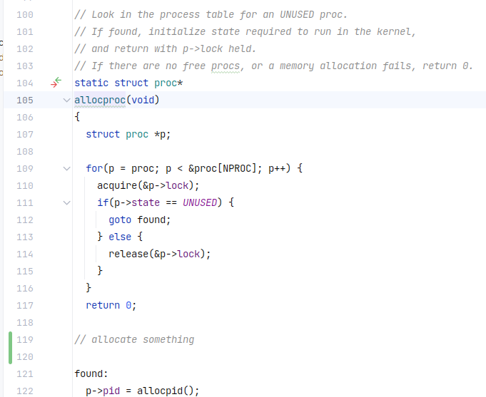
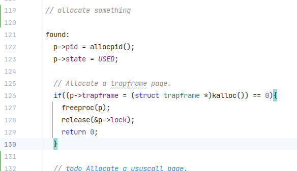
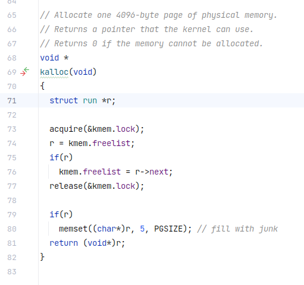
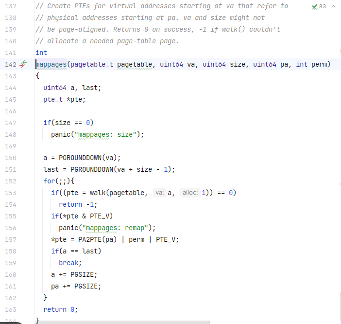
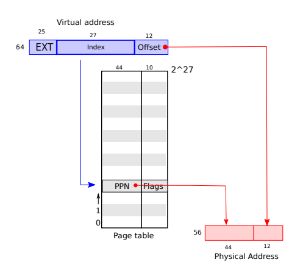

### 分析`userinit`代码

在内核加载完毕之后创建的第一个进程就是这个：

```cpp
// Set up first user process.
void
userinit(void)
{
  struct proc *p;

  p = allocproc();			//xv6的第一个进程，其pid = 1
  initproc = p;
  
  // allocate one user page and copy init's instructions
  // and data into it.
  uvminit(p->pagetable, initcode, sizeof(initcode));
  p->sz = PGSIZE;

  // prepare for the very first "return" from kernel to user.
  p->trapframe->epc = 0;      // user program counter
  p->trapframe->sp = PGSIZE;  // user stack pointer

  safestrcpy(p->name, "initcode", sizeof(p->name));
  p->cwd = namei("/");

  p->state = RUNNABLE;

  release(&p->lock);
}

```

从第7行`alloproc()`开始：



可以发现这个函数是为了给状态为`UNUSED`（表示该进程表项PTE当前未被使用）的进程使用的，遍历每一个进程，在xv6中，`NPROC`宏定义为64，如果找到状态为`UNUSED`的，就给该进程分配一个表单和初始化进程控制块等等。



#### todo（查询trapframe）

随后来到12行，跟踪`uvminit`，到达`vm.c`

```cpp
// Load the user initcode into address 0 of pagetable,
// for the very first process.
// sz must be less than a page.
void
uvminit(pagetable_t pagetable, uchar *src, uint sz)
{
  char *mem;

  if(sz >= PGSIZE)
    panic("inituvm: more than a page");
  mem = kalloc();
  memset(mem, 0, PGSIZE);
  mappages(pagetable, 0, PGSIZE, (uint64)mem, PTE_W|PTE_R|PTE_X|PTE_U);
  memmove(mem, src, sz);
}
```

看完注释之后其实我也不是很明白到底是什么意思，好像是为第一个进程加载一个`initcode`，先放下不管吧，先来了解下`uvminit`是干嘛的，再来看调用这个函数的目的

阅读源码发现出现了`kalloc()`，于是继续深入，翻看源码



不难通过注释看出，这个函数是分配页表的，但是本着深究的精神，我们来详细解释这里吧！

```cpp
struct run {
  struct run *next;
};

struct {
  struct spinlock lock;
  struct run *freelist;
} kmem;
```

在xv6的物理内存分配器中，`struct run`结构体是用来维护一条可用的内存块链表。

结合这个可以发现，原来`kalloc()`74-76行是**为了找到一个可用的内存块！**

继续阅读`uvminit`，查看`mappages`函数

PS：可能这里会有人对`panic`有疑问，这个函数就是用来报错的，涉及到中断处理程序，目前先搁置一旁。



注释的意思就是创建一些PTE，使得从虚拟地址`va`开始的一段内存可以映射到从物理地址`pa`开始的一段内存。同时强调了虚拟地址`va`和内存大小`size`不一定是按页对齐的（实际应用中，虚拟地址和内存大小往往不会正好是页大小的倍数），最后就是通过`walk()`函数来决定是否能分配，能返回0（创建成功！），否则返回-1。

再来看看源码，`PGROUNDDOWN`是什么鬼？！于是我直接跳转，发现竟然是`riscv.h`里面的

```cpp
#define PGROUNDDOWN(a) (((a)) & ~(PGSIZE-1))
```

大眼瞪小眼...通过计算器发现PGSIZE-1 = 4095 =$$(111111111111)_2$$，那么取反之后全部为0，原来如此！原来这个宏定义就是为了清除给定地址的低12位，从而得到物理地址的具体位置，为什么我会知道呢？这就不得不扯到xv6手册的一张图



如图就可以解释了。

```cpp
// shift a physical address to the right place for a PTE.
#define PA2PTE(pa) ((((uint64)pa) >> 12) << 10)
```

通过注释不难看出`PA2PTE`是用来将物理地址转成

#### 暂停一下，先看看第三章页表再来写

