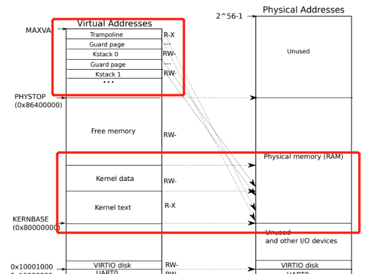
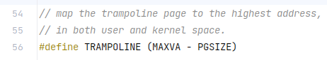
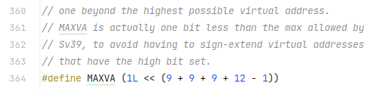
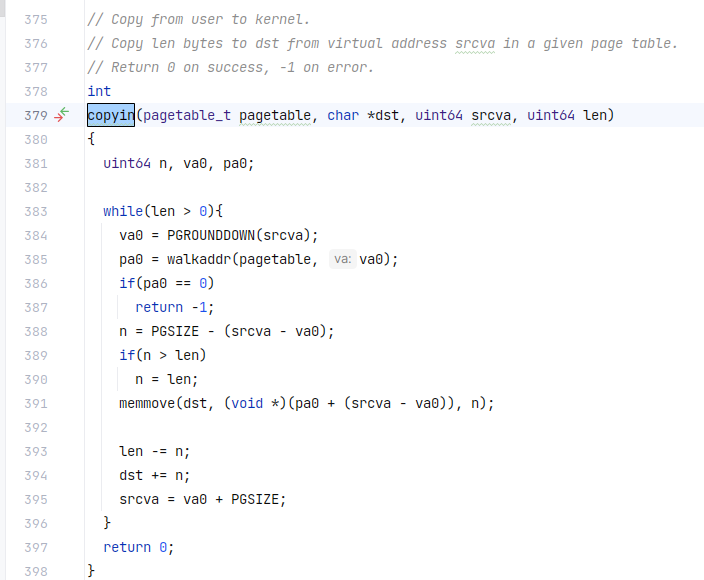
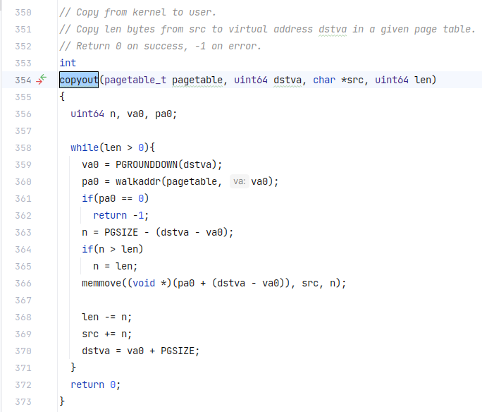

- Q：如何根据虚拟地址来查询物理地址？

- A：如下图，首先我们有一个虚拟地址，然后根据虚拟地址的前27位的index（后面有讲EXT）索引到页表的页表项PTE，然后找到PPN，最后根据PPN和虚拟地址的偏移量Offset组合成物理地址。

  

  有的人可能会问那虚拟地址最前面的25位是什么？在RISC-V中，虚拟地址的EXT部分时用于扩展虚拟地址的。

- Q：那么这里我就又有一个问题了，页表是存在哪里的呢？虚拟地址怎么访问页表的呢？虚拟地址的前27位是页表的物理地址吗？

- A：好，那么Figure3.2图也给出了解释（如下图），可以观察到页表已经分为了三级，一级页表是存储在satp寄存器中的，此时通过satp找到一级页表，然后通过高九位（L2）查找到PPN，根据PPN定位到二级页表，同上，最后找到三级页表的PPN，再根据虚拟地址的偏移量Offset（低12位）组合成最终的物理地址。

  那么现在就可以解释上面的问题了。

  首先第一个问题，**一级页表是存储在satp寄存器中的，也就是缓存（cache），二级和三级页表一般是存在内存中的。**

  第二问，已经在上文给出了答案，但是再补充一点！**在CPU需要查找虚拟地址对应的物理地址时，会用到MMU，在MMU中存储了一张虚拟地址与物理地址映射的表单，通过MMU进行转换后，在satp寄存器中定位到一级目录**。

  第三问，并不是！**虚拟地址的前27位的其中9位是用于索引某一级页表的页表项**，得到PPN，通过PPN定位到下一级页表，再用其中9位索引该页表的页表项。

  

  这里我发现每一级的页表只有512个页表项，经过chatGPT大法，得到原来是由RISC-V架构规定的。

  然后我又发现一个问题，为什么这里只有`Page Directory`？我的Page table去哪里了！经查阅发现，每一级页表都有不同的称呼，级别从高到低分别为`Page Directory`，`Page Middle Directory`和`Page table`。原来如此！那么三级页表才叫做Page table。

  在这张表还存有PTE的结构，flags标志位的每位都代表着不同的意思，这里不做过多叙述。

- 根据书上描述“plus a single page table that describes the kernel’s address space”，可以得出，内核的运行是需要一个页表的，就只有一个哦！继续阅读下去，发现在这个页表中，内核配置了地址空间的布局，以便在虚拟地址上访问对应的物理地址和各种硬件资源

  [todo][]这里到时候记得要翻看一下文件（kernel/memlayout.h），这里声明了xv6内核内存布局从常量。

- 在xv6中，内核采用**直接映射**的方式来获取RAM和内存映射设备寄存器（English/TechnicalTerm.md:8），也就是说，内核空间中虚拟地址和物理地址是相同的。

  如下图，内核在虚拟地址空间和物理内存都位于`KERNBASE = 0x80000000`上，有什么好处呢？答案是直接简化了读取或写入内存的内核代码！

  又例如，当`fork`（kernel/proc.c）为子进程分配用户内存时，分配器返回该内存的物理地址，于是`fork`将父进程的用户内存复制到子进程时，直接将该地址作为虚拟地址。

  [todo][]凡事都要讲个证据，直接映射具体代码在哪呢？还有`fork`真的是这样吗？

  

- 从图上我还发现了比较有意思的一点，内核代码和内核数据是直接映射到物理内存（RAM）中的，而且`PHYSTOP`到`MAXVA`之间存放着内核的数据段和内核的堆。具体来说，它包括内核数据结构、内存分配器、系统调用参数和返回值缓冲区、各种缓冲区以及其他内核需要数据等等。

  这里其实还要解释一下内核代码和内核数据分别是用来做什么的，[todo][]

  

- 紧接上图啊！有些内核虚拟地址不是直接映射的：

  - `The trampoline page`：内核和用户进程之间的一个共享的虚拟页面，并且用户进程和内核使用相同的映射来访问`trampoline page`，它被映射到虚拟地址空间的最高地址处。

    

    

    

    查阅代码可以发现这个`trampoline page`确实是这么大，`PGSIZE = 4096`，实际上`MAXVA`并没有这么大，这么大只是为了避免符号扩展的问题。实际上我也不太清楚是多少，不过在`Sv39`中最高位的地址是$2^{38}$，用16进制表示就是`0x4000000000`。不过再怎么说，`trampoline page`也是一个页表的大小，**而且是最后一个页表！**

    - > [todo][]然后其实这里我还想查找一下用户进程和内核之间的切换，part4肯定有机会的！

    当用户进程执行系统调用时，内核只需要切换页表，然后就可以直接访问`trampoline page`，获取系统调用参数并执行系统调用。

    好处就是，内核可以通过访问`trampoline page`来实现对用户进程的访问，无需再次切换到用户进程的虚拟地址空间。虽然执行系统调用时进行了页表切换，但是不需要进行地址空间切换，因此提高了系统调用的性能和效率

- Q：到这里我其实又有一个疑问，地址空间切换和页表切换有什么区别？为什么有了`trampoline page`就不用进行地址空间切换了？

  A：第一个问题，地址空间切换指的是进程与进程之间的切换，而页表切换

  第二个问题，由于[todo][]的原因，现在只能比较笼统地解释。

  从chatGPT给出的答案总结：是因为`trampoline page`包含了一些内核代码，用于执行系统调用，当用户进程执行系统调用时，只需要切换一次页表，将页表映射到`trampoline page`上，然后直接执行内核代码，刚刚提到这里面包含了内核代码，同时这里也包含了用户进程地址空间的映射，所以执行系统调用时，可以无需进行地址空间切换。

  据我理解，就是不需要切换到内核进程，只需要跳转到`trampoline page`直接执行有关系统调用的代码即可。

- 每个进程都有自己的内核栈，内核栈被映射到足够高到xv6在它下面可以留下一个未被映射的保护页，**保护页的PTE无效**（感觉很重要，待会做lab可能会参考到）

- 在阅读到`copyout`和`copyin`时（kernel/vm.c），我发现这个翻译太晦涩难懂了，于是我又问了问chatgpt，下面解释这两个函数的作用。

  在内核空间和用户空间之间进行数据传输，具体来说，它们将数据从内核缓存区（内核与用户之间的一种隔离isolation）复制到用户空间的虚拟地址，或者将数据从用户空间的虚拟地址到内核缓冲区。

  这些虚拟地址通常是作为系统调用参数提供的`uint64 srcva`，因为用户进程需要向内核传递数据。[todo][]阅读代码，了解copyin和copyout的运作。

  

  

- [todo][]其实我读到这里有一个很深的疑问，很让我想阅读源码，就是内核究竟在哪，用户和内核是怎么运作的呢？

- [todo - finished][]Q：既然一个进程对应一个页表，而且页表有许多页表项，那么页表都存了啥？可能是指令之类的，每个指令都有一个或者多个PTE？

- A：芜湖，我终于搞懂了，原来一个进程确实是对应一个页表，但是页表不是用来存数据的，**页表存的是页面**（这个好像是一个新概念，待会解释）**的虚拟地址和物理地址的映射关系**。即一个进程对应一个页表，而一个页表对应多个页面，页面存放的都是有关该进程的信息。

  实际上这些映射关系指向的物理地址中存放了实际的数据。因此，数据时存放在页面中，而不是存放在页表中。

  这里还有一个tips就是**页面和页表的大小都是4KB**


- `kvminithart()`

  ```cpp
  // Switch h/w page table register to the kernel's page table,
  // and enable paging.
  void
  kvminithart()
  {
    w_satp(MAKE_SATP(kernel_pagetable));
    sfence_vma();
  }
  ```

  相关代码：

  ```cpp
  // supervisor address translation and protection;
  // holds the address of the page table.
  static inline void 
  w_satp(uint64 x)
  {
    asm volatile("csrw satp, %0" : : "r" (x));
  }
  ```

  ```cpp
  #define MAKE_SATP(pagetable) (SATP_SV39 | (((uint64)pagetable) >> 12))
  ```

  首先

  ```cpp
  // flush the TLB.
  static inline void
  sfence_vma()
  {
    // the zero, zero means flush all TLB entries.
    asm volatile("sfence.vma zero, zero");
  }
  ```

  