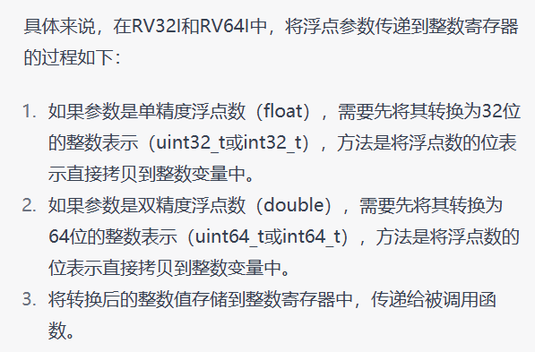

1、`C type`在寄存器中，如果`Bytes`不够寄存器的位数，那么高位就会全部被符号位所代替。

2、C进行参数传递时，对于整数参数，使用a0-a7这8个整数寄存器来传递，对于浮点数参数，则使用fa0-fa7这8个浮点寄存器来传递。

3、如果参数少于等于8个，将会用影子参数寄存器存储，类似与一个结构体指针引用，包含了8个参数，可以避免将整个结构体压入堆栈，提高函数调用的效率。

4、如果浮点参数存储器不够用，将会把浮点参数也传递到整数寄存器中，不过会损失精度

5、浮点数如何存储到整数寄存器的问题：

6、如果参数大于8会怎么样？A：超出的参数会按照一定顺序被传递到堆栈上（超出的第9个将被存储在栈帧中偏移量位0的位置，第10个参数将被存储在偏移量为4的位置，以此类推。），在函数中访问这些参数时，需要使用**基址寄存器**（通常是sp，栈指针寄存器）加上适当的偏移量来访问它们。

7、RISC-V参数传递规则：

- 如果一个参数大小小于一个指针字，则该参数将被传递到参数寄存器的最低有效位，如果是通过栈传递，因为RISC-V具有小端内存系统，在小端内存系统中，较低的子节存储在较低的地址中。
- 如果一个参数大小刚好是指针字的两倍时，如果是通过栈传递，它会自然地对齐。如果存储在寄存器，某个函数只有两个参数，且第二个是64位长整型，在RV32架构中，这个函数的第一个参数存储在a0、而第二个参数存储在寄存器a2和a3中，在这种情况下，a1会被浪费。
- 如果参数的大小超过了指针字的两倍，则会通过引用传递，即参数在栈上分配内存，通过传递指向该内存的指针来传递参数值。

8、未在参数寄存器中传递的结构体的一部分将通过栈传递，栈指针sp指向第一个未在寄存器中传递的参数。

9、函数返回值被传递到整数寄存器a0和a1（a0和a1既作为参数寄存器又作为返回值寄存器）以及浮点寄存器fa0和fa1中。仅当返回值是基本数据类型或结构体只包含一个或两个浮点数值时，浮点值才会在浮点寄存器中返回。如果存在更大的返回值，会存储在内存中。

10、除了参数和返回值寄存器外，还有七个整数寄存器t0-t6和十二个浮点寄存器ft0-ft11，它们是临时寄存器。另外有十二个整数寄存器s0-s11和十二个浮点寄存器fs0-fs11是跨函数调用保持的，如果使用必须由被调用方保存。

11、Soft-float是一种浮点数运算的实现方式，它在不依赖硬件浮点数运算指令的情况下，通过使用纯软件的方法来进行浮点数计算。